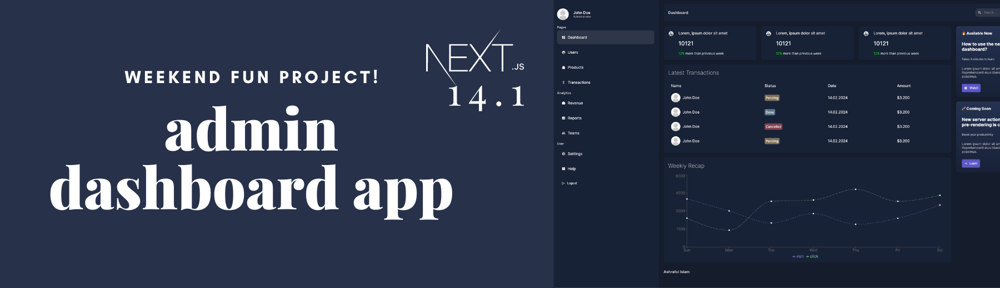

<div align="center">
  <br />
    <a href="https://github.com/islamashraful" target="_blank">
      
    </a>
  <br />
  <br />
  <h1 align="center">Next.js Admin App</h1>

<div align="center">
A weekend fun project to develop an admin dashboard app using Next.js 14<br/><br/>
</div>
<div align="left">
One of the most hyped things with Next.js 14 is the <a href="https://nextjs.org/docs/app/building-your-application/data-fetching/server-actions-and-mutations">server actions</a>, which allows mutations without writing any dedicated API. Server action enables avoiding the vulnerabilities and security concerns of fetching and mutating data from the client. This project uses server actions for all the mutations. 
</div>
</div><br/>

This [Next.js](https://nextjs.org/) project bootstrapped with [`create-next-app`](https://github.com/vercel/next.js/tree/canary/packages/create-next-app).

## <a name="tech-stack">⚙️ Tech Stack</a>

- Next.js 14
- NextAuth.js
- Server Actions 🚀

## Getting Started

**Cloning the Repository**

```bash
git clone https://github.com/islamashraful/nextjs-admin-app.git
cd nextjs-admin-app
```

**Installation**

Install the project dependencies using yarn:

```bash
yarn
```

**Set Up Environment Variables**

```env
MONGO=mongodb+srv://<username>:<password>@cluster0.rlqur99.mongodb.net/<dbname>?retryWrites=true&w=majority
AUTH_SECRET=your-secret-key
AUTH_URL=http://localhost:3000/api/auth
```

Replace `MONGO` with your mongodb connection string in `.env` file. You can obtain a key by signing up on the [MongoDB Atlas](https://www.mongodb.com/lp/platform/atlas).

**Running the development server**

```bash
yarn dev
```

Open [http://localhost:3000](http://localhost:3000) with your browser to see the result.

## <a name="snippets">🕸️ Server Actions Snippets</a>

<details>
<summary><code>app/lib/actions.js</code></summary>

```js
export const addProduct = async (formData) => {
  const { title, desc, price, stock, color, size } =
    Object.fromEntries(formData);

  try {
    await connectToDB();

    const newProduct = new Product({
      title,
      desc,
      price,
      stock,
      color,
      size,
    });

    await newProduct.save();
  } catch (err) {
    console.log(err);
    throw new Error("Failed to create product!");
  }

  revalidatePath("/dashboard/products");
  redirect("/dashboard/products");
};

export const deleteUser = async (formData) => {
  const { id } = Object.fromEntries(formData);

  try {
    connectToDB();
    await User.findByIdAndDelete(id);
  } catch (err) {
    console.log(err);
    throw new Error("Failed to delete user!");
  }

  revalidatePath("/dashboard/users");
};
```

</details>

<details>
<summary><code>app/dashboard/products/add/page.jsx</code></summary>

```js
import { addProduct } from "@/app/lib/actions";

import styles from "@/app/ui/dashboard/products/addProduct/addProduct.module.css";

const AddProduct = () => {
  return (
    <div className={styles.container}>
      <form action={addProduct} className={styles.form}>
      <input type="text" placeholder="title" name=" ...
      ....
```

</details>

## Resources

To learn more about Next.js, take a look at the following resources:

- [Next.js Documentation](https://nextjs.org/docs) - learn about Next.js features and API.
- [Learn Next.js](https://nextjs.org/learn) - an interactive Next.js tutorial.
- [Nextjs Server Actions and Mutations](https://nextjs.org/docs/app/building-your-application/data-fetching/server-actions-and-mutations) - Details guideline for server actions and mutations
- [NextAuth](https://nextjs.org/learn/dashboard-app/adding-authentication) - add authentication to your application
- [Credential Provider](https://next-auth.js.org/providers/credentials#options) - Guideline for username/password based auth
